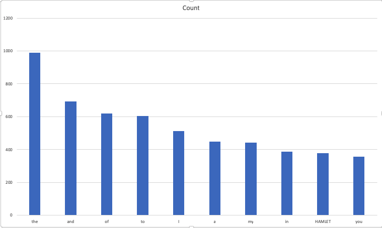

## Links
- [Webpage](https://turingloop.github.io/spark-scala-wordcount)
- [Source](https://github.com/turingloop/spark-scala-wordcount)

## About Myself & Objective

My name is Goutham Reddy Neravetla(I prefer gotham reddy), and I am a student at Northwest Missouri State University. I am majoring in computer science and hopefully finish my math minor as well. This project is a requirement for my Big Data class, but i am also having fun doing it! I am find the top 10 most frequently used words in Shakespeare's play Hamlet.

## Data

I created a text file from this source.

- [Hamlet](http://shakespeare.mit.edu/hamlet/full.html)

## Scala Commands

```Scala
scala> val inputFile = sc.textFile("data/hamlet.txt")
scala> val topWordCount = inputFile.
     |   flatMap(str=>str.split(" ")).
     |   filter(!_.isEmpty).
     |   map(word=>(word,1)).
     |   reduceByKey(_+_).
     |   map{case (word, count) => (count, word)}.
     |   sortByKey(false)
scala> topWordCount.take(10).foreach(x=>println(x))
```
## Results

You will see the following results after you give the last command from Scala Commands section:

|  Word  | Count |
|:------:|-------|
| the    | 988   |
| and    | 693   |
| of     | 621   |
| to     | 604   |
| I      | 513   |
| a      | 450   |
| my     | 441   |
| in     | 387   |
| HAMLET | 378   |
| you    | 356   |

Most frequently used word is "the" which has a count of 988 and the 10th most frequently used word is "you". You can see the count of the top 10 most frequently used words in the table above.

Using this table, i generated this chart.

